# Car Rental Service

## Overview
This project is a comprehensive **Car Rental Service web application** developed using the CodeIgniter framework. It provides a full-featured system for customers to browse and rent vehicles, alongside a robust administrative dashboard for managing the fleet, user accounts, and bookings.

---

## Features

### CodeIgniter (PHP) User Interface
- **Homepage:** A visually appealing landing page showcasing recent cars and key service statistics, giving users a quick overview of what's available.

- **Car Listing:** A page where users can browse all available cars. It includes search and filter options to find cars by location and brand, with a clear display of car images and pricing.

- **Car Details:** A dedicated page for each car, providing a detailed description, specifications, and a prominent call-to-action for booking.

- **User Authentication:** Secure customer login and registration with a two-step authentication process to ensure data protection and allow users to manage their bookings and details

- **Booking Process:** A straightforward, step-by-step form for customers to input their rental information and finalize a booking.

---

### Admin Dashboard
- **Dashboard Overview:** A centralized administrative hub that provides key metrics at a glance, such as total cars, customers, locations, brands, and fuel types.

- **Admin Authentication:** A dedicated login page for administrators to securely access the backend of the application.

- **Admin Registration:** A specific form for registering new administrators.

- **Car Management:** Comprehensive tools to add, edit, or delete cars from the fleet. This includes setting details like brand, fuel type, and price per day.

- **Brand Management:** Easily manage and organize car brands available in the system.

- **Fuel Management:** Add and manage different fuel types (e.g., Petrol, Diesel, CNG) as options for the cars.

- **Location Management:** Manage car delivery and pick-up locations with an integrated map view for geographical context.

- **Booking Management:** Administrators can view, approve, or reject customer bookings, giving them full control over the rental process.


## Technologies Used
- **Backend:** PHP (CodeIgniter Framework)(Version 3.1.10)    
- **Frontend:** HTML, CSS, JavaScript
- **Database:** MySQL  
- **Tools:** Sublime Text, XAMPP  
- **Version Control:** Git & GitHub  

---

## Installation and Setup

**Installation**
 To get this project up and running locally, follow these steps:

**Clone the Repository**

git clone [https://github.com/MuhsinaMiti/Car-Rental-Service.git](https://github.com/MuhsinaMiti/Car-Rental-Service.git)
cd Car-Rental-Service

**Database Setup**

- Create a new MySQL database for the project (car).

- Import the provided SQL file (car.sql) to set up the necessary tables and initial data.

**Configuration**

- Open the CodeIgniter configuration files (e.g., application/config/database.php).

- Update the database connection details to match your local setup.

**Run the Application**

- Place the project files in your web server's root directory (e.g., htdocs for XAMPP, www for WAMP).

- Open your browser and navigate to http://localhost/Car-Rental-Service


## Login Credentials

### Admin Account
- **Username:** miti@gmail.com   
- **Password:** 123456  

### Customer Account
- **Username:** miti@gmail.com  
- **Password:** 123456

> These accounts are for demo purposes. Please change/remove them in production.


## Project Structure

```
Car-Rental-Service/
├── application/            # Application-specific files
│   ├── config/             # Configuration files
│   ├── controllers/        # Application logic controllers
│   │   ├── Admin.php
│   │   ├── Admin_login.php
│   │   ├── Booking.php
│   │   ├── Car.php
│   │   ├── Car_filter.php
│   │   ├── Customer.php
│   │   ├── Home.php
│   │   └── Welcome.php
│   ├── models/             # Database interaction models
│   ├── views/              # Presentation files (HTML and PHP)
│       ├── admin/          # Admin-related views
│       │   └── admin_pages/
│       ├── errors/ 
│       ├── pages/          # Public-facing pages
│       └── includes/       # Reusable components
│       
│               
├── assets/                  # static assets (CSS, JS, images)
│   ├── css/
│   ├── js/
│   └── images/
│
├── screenshots/            # Project screenshots
│
├── SQL file/
│   └──car.sql              # Database export
│
├── uploads/                # Directory for uploaded images
├── system/                 # CodeIgniter framework core files
└── index.php               # Front controller
```

---


## Screenshots

### Dashboard

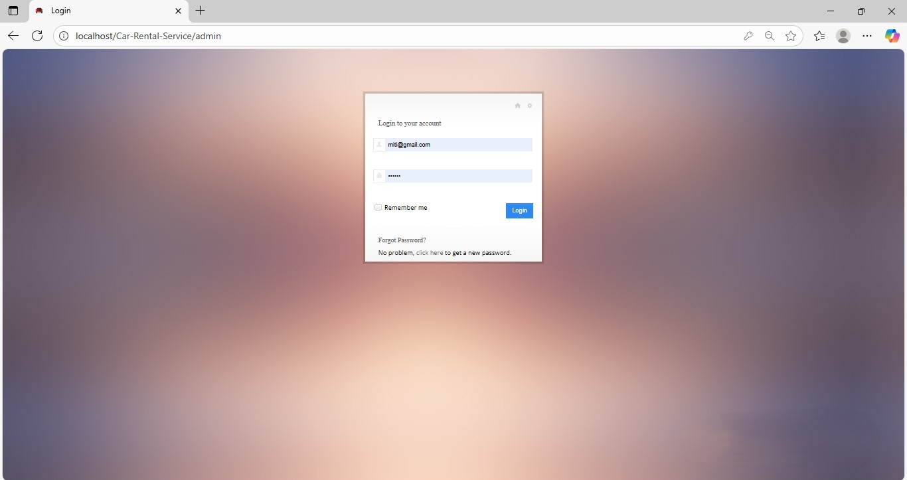

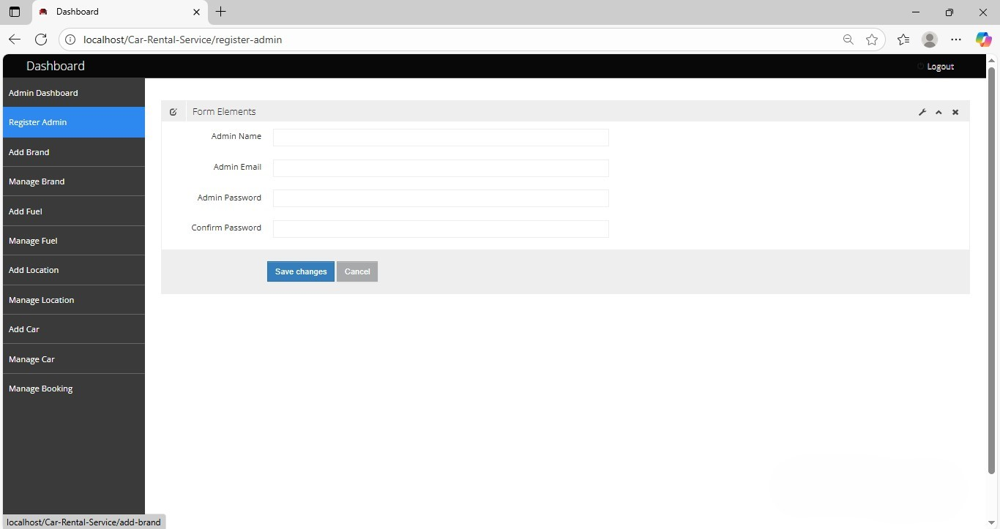
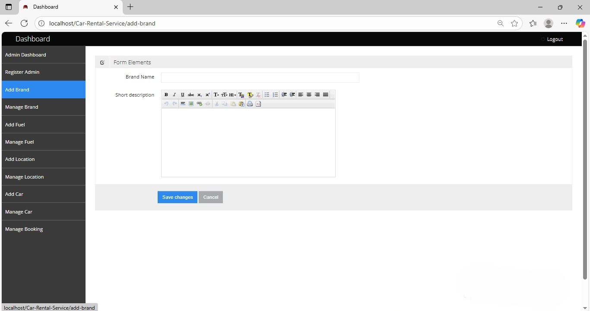
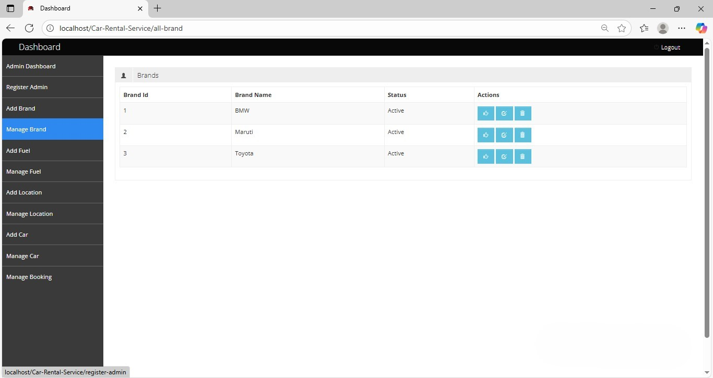
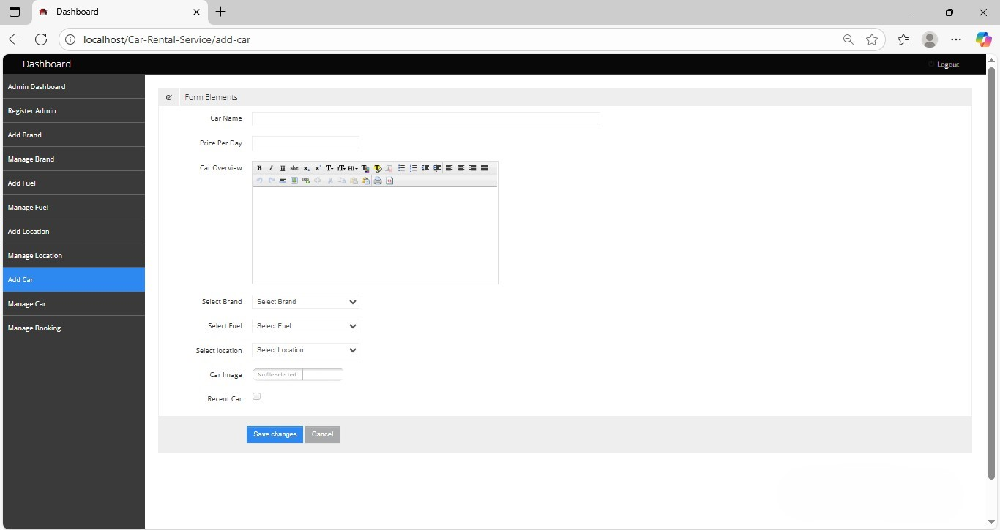
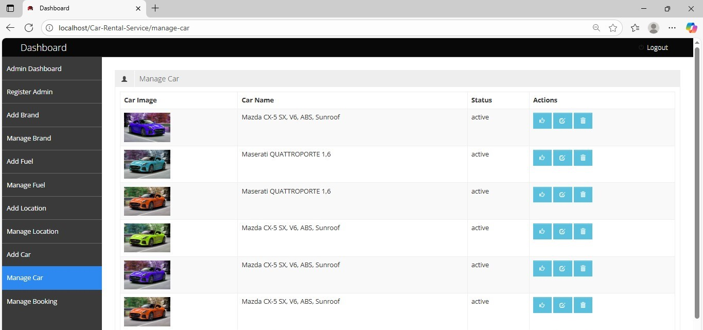
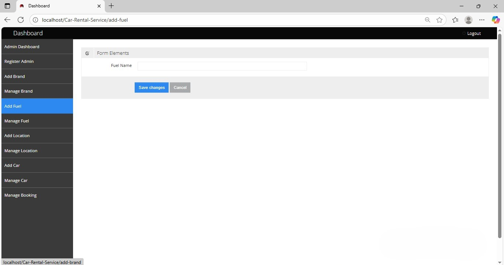
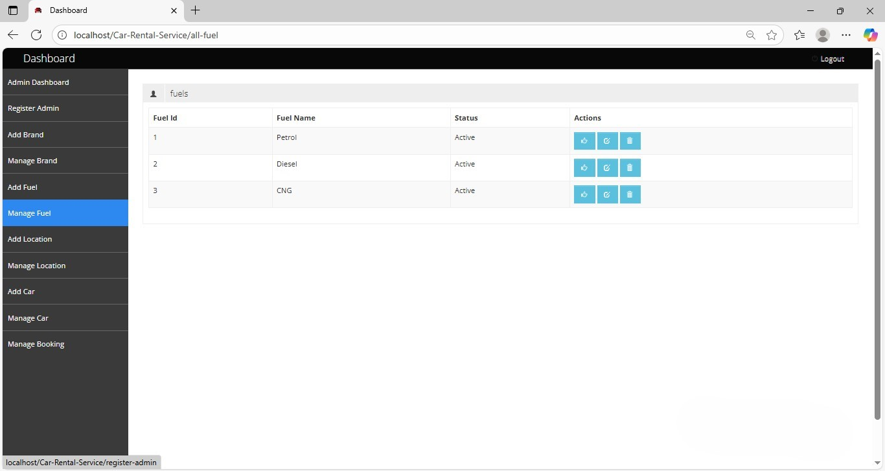
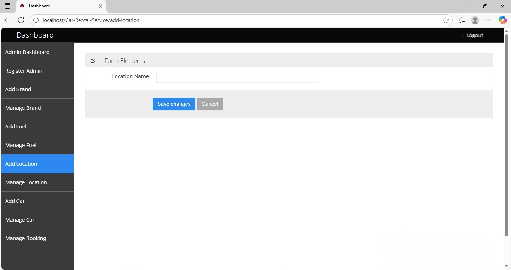
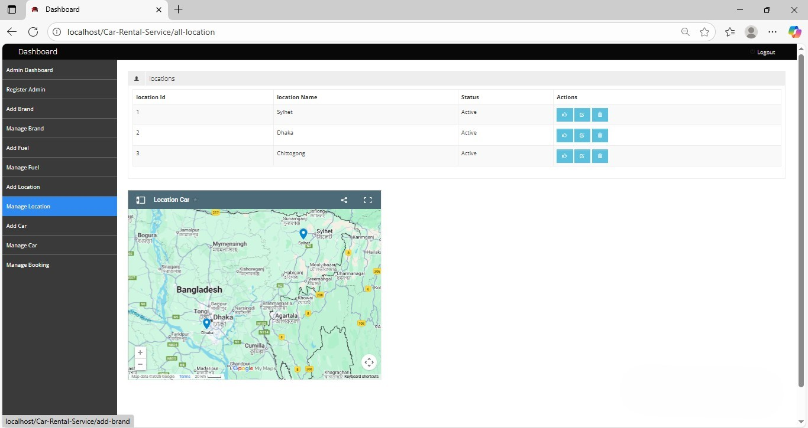
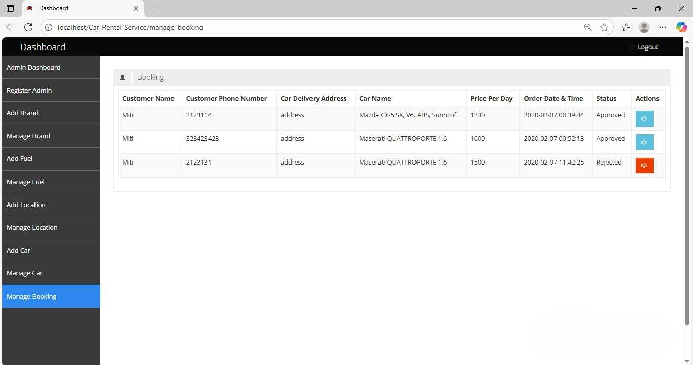


### Customer View
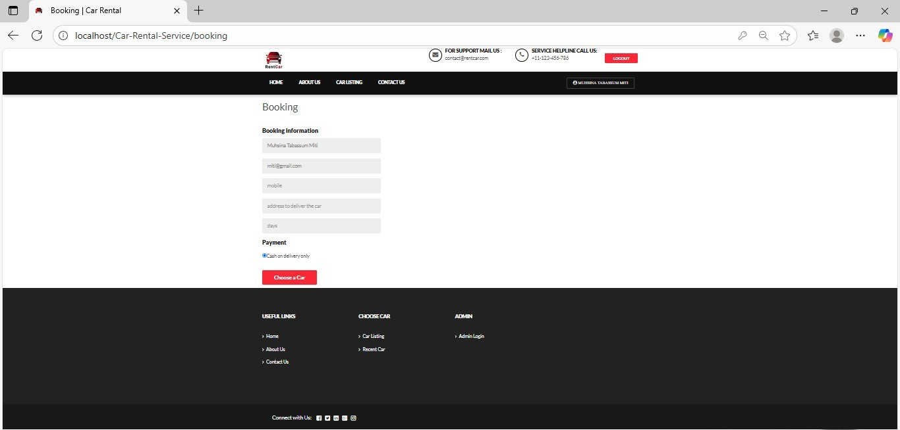
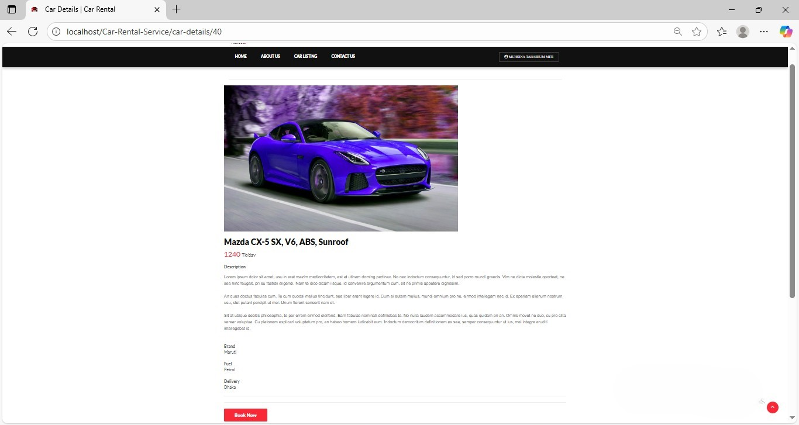
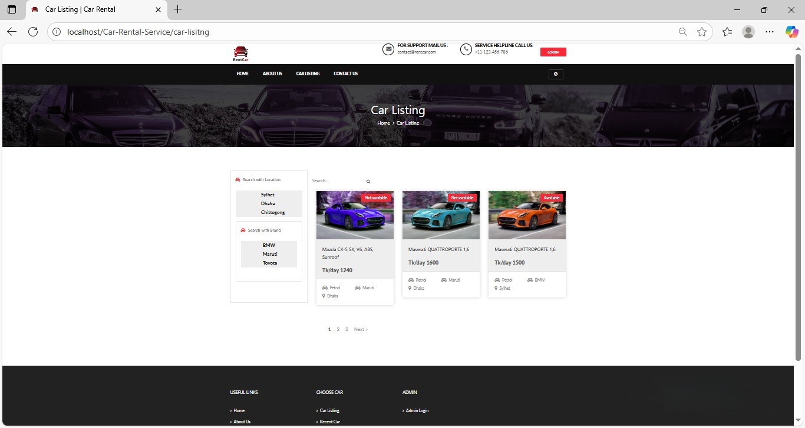
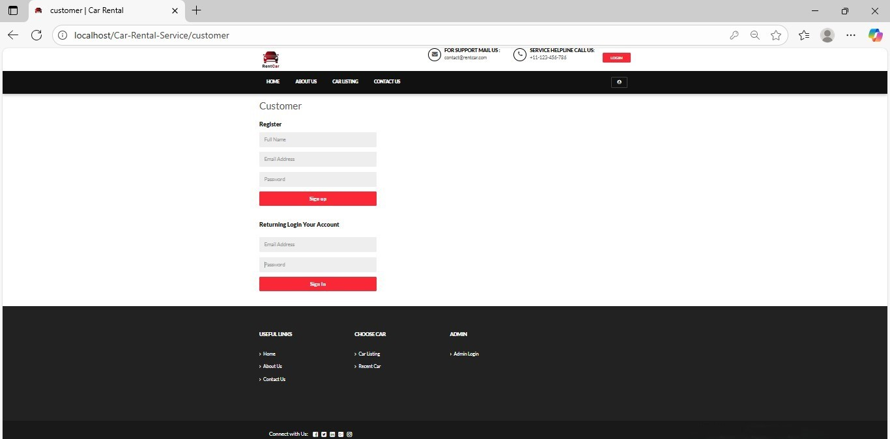
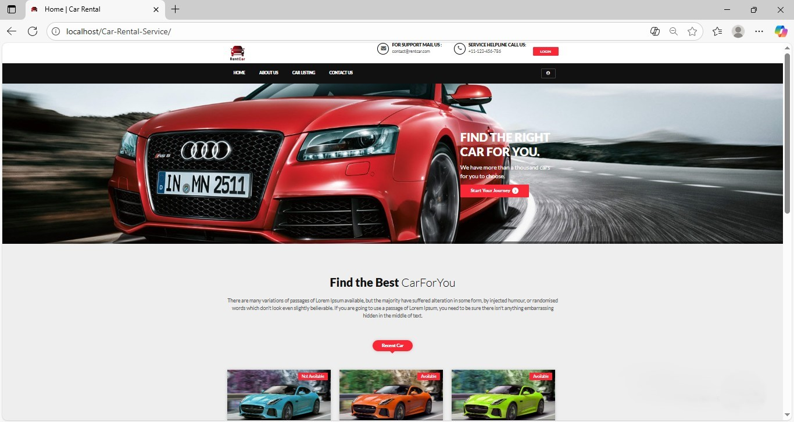
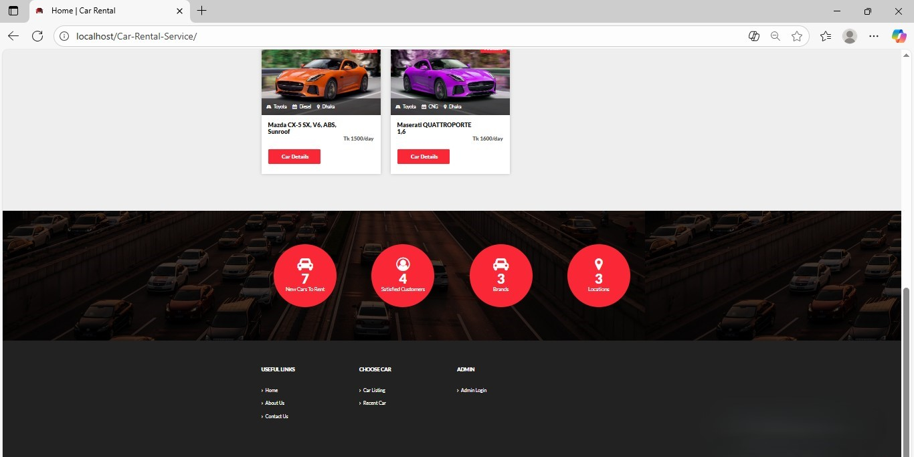
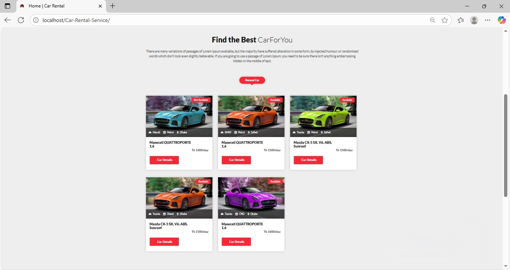

---

## Acknowledgments
This project, which serves as my final year project, was built as a significant learning experience. I would like to express my sincere gratitude for the inspiration and guidance taken from tutorial videos on YouTube. A special thanks to the creators of this YouTube channel for providing invaluable resources that helped me understand the CodeIgniter framework and complete this project.

https://www.youtube.com/@TalhaTraining


